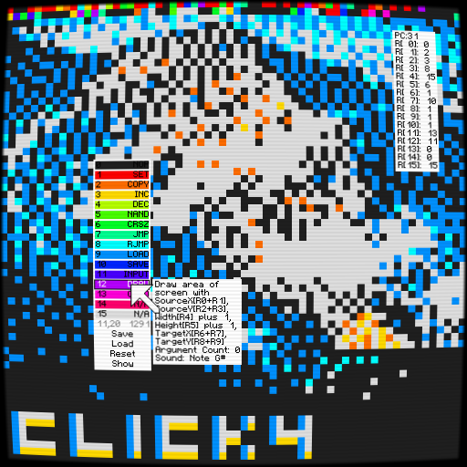

# Click4	

Click4 (pronounced click-ah) is a fantasy console based on nibbles.

## Features:

* Mouse driven visual editor!
* Sixteen assembly operands!
* Sixteen registers!
* Sixteen colors!
* 64x64 nibbles of RAM for all your code, music, art and data!
* 64x64 nibbles of VRAM.
* Sound Queue with 16 sounds (A&rarr;G#, including a rest and three goofy noises!)

## Controls:

To begin or stop execution, **Press Tab**.

To show console information, **Press R**.

To access primary functions or change a value in memory, **click on the 64x64 grid**. A context menu containing the following will appear:

* **0-15**: Change the selected memory value.
* **X,Y  PC**: The current X,Y location and the raw index.
* **Save**: Save the current program to `cart.png`
* **Load**: Load the current program from `cart.png`
* **Reset**: Clear the entire cart in memory.
* **Show**: Show the file location of `cart.png`

To change the scale of the console, **Press - or +**.

To close the context menu, **Press Escape**.

## Documentation:

Full op code documentation can be found [here](docs.md).

Usage and Language Specification can be found [here](usage_and_lang_spec.md)
